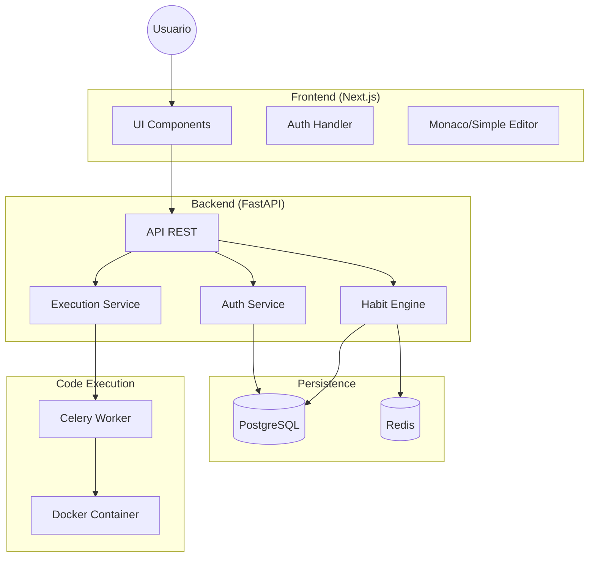

# PyHabit - Arquitectura (MVP 1.0)

## 🧠 Visión General



## 🛠️ Stack Tecnológico

### Frontend (`apps/web`)

- **Framework**: Next.js 14+ (App Router).
- **Estilos**: Tailwind CSS 3.4+.
- **Componentes**: Headless UI / Radix UI.
- **Iconos**: Lucide React.
- **Editor**: `react-simple-code-editor` o Mónaco (versión ligera).

### Backend (`apps/api`)

- **Framework**: FastAPI (Python 3.11+).
- **ORM**: SQLModel o SQLAlchemy + Pydantic.
- **Baza de Datos**: PostgreSQL 16.
- **Cache/Queue**: Redis 7.

### Infraestructura Local

- **Docker Compose**: Orquestación de API, DB, Redis y Workers.

## 📂 Estructura de Proyecto (Monorepo)

```
pyHabits/
├── apps/
│   ├── web/            # Next.js Frontend
│   └── api/            # FastAPI Backend
├── docs/               # Documentación (Manifesto, Design, Backlog)
├── docker-compose.yml  # Orquestación local
└── README.md
```
